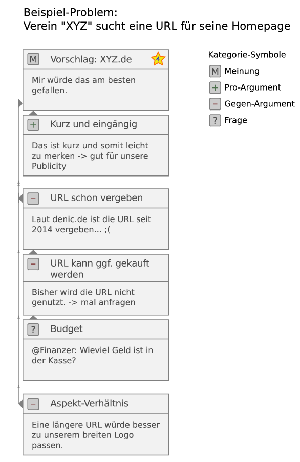

# sober
Web-Dienst für konstruktive Diskussionen
 
Diese Datei enthält die Kurzbeschreibung des Projekts basierend auf einem Antrag zum [Prototypefund](https://prototypefund.de)
der [OpenKnowledge Foundation](https://okfn.de/) sowie weitere Informationen (z.B. [Entwürfe für das UI-Design](#darstellung)).

## Problem
- Zunehmende Polarisierung der Gesellschaft in Lager, die kaum noch sachlich miteinander diskutieren können
- Effekt paradoxerweise durch Web  verstärkt: Statt besserem Zugang zu anderen Perspektiven Bildung von Echokammern/Filterblasen
- "Shitstorms und Flamewars" in sozialen Netzen, Mailinglisten oder Kommentaren
- Starke emotionale Aufladung komplexer Themen → Kompromisse schwieriger
- Eskalierende/unproduktive Diskussionen auch in kooperativen Gruppen/Vereinen
- Gründe: Verlust der Übersicht durch zu viele Meinungsbeiträge, chronologische Sortierung unzweckmäßig, Argumentationen oft schwer nachvollziehbar, Verwechslung inhaltlicher und persönlicher Kritik, Moderation problematisch

## Lösungsidee

- Probleme der Diskussionskultur nicht allein technisch lösbar
- Aber: geeignete (basierend auf bisherigen Erfahrungen) Software kann Beitrag zur Verbesserung leisten

→ Entwicklung eines Webservice, der konstruktive und nachvollziehbare Diskussionen fördert bzw. das "Eskalieren" erschwert

### Key-Features:
- Kategorisierung der Diskussionsbeiträge in: Meinung, Pro-Argument, Gegen-Argument und Frage
- Bewertung der Beiträge nach Überzeugungskraft
- Redundanzvermeidung und Moderation durch Peer-Review (inspiriert von http://stackexchange.com)
- Einfaches Zitieren/Verweisen anderer Beiträge und externer Quellen
- Jeder Beitrag kann Ausgangspunkt einer neuen Diskussion sein → Baum-Struktur → klare Bezüge
- Übersichtliche Standard-Darstellung (http://kurzlink.de/sober)
- Weitere Ansichten z.B. "Baum-Überblick" oder "Pro-vs.-Kontra" (wie bei http://brabbl.com)
- Klar formulierte und eingeforderte Diskussionsregeln (Was sind überzeugende Argumente, gegenseitiger Respekt,... )
- Optionales Ausblenden der Urheberschaft um "sozialen Druck" zu entschärfen
- Mailintegration
- Datensparsamkeit

### Annahmen:
- Die Mehrheit der Teilnehmer*innen ist prinzipiell Willens und fähig zu konstruktiver Diskussion
- (fehlende) Features beeinflussen Kommunikationsmechanik (z.B. Selbstreflexion)

## Darstellung

- Viele Kommunikations/Diskussionsplattformen leiden unter Unübersichtlichkeit
- Negativbeispiele:
  - tageschau.de, spiegel.de, youtube.com
  
- Zentrale Herausforderung von sober: Übersichtliche Darstellung von Inhalt, Bezügen, Qualität
- Eigentliche Design-Phase beginnt mit Projektstart
- Bisher: 2 Vorentwürfe:

## Team

### Ilja Göthel
- Freier Programmierer

### Carolin Horn
- Studentin technisches Design
- Mitarbeit bei [Studieren ohne Grenzen](https://www.studieren-ohne-grenzen.org/),
 - u.a Projekt: [Fahrradspendentour 2017](https://spendenradtourdresden.wordpress.com/tour-2017-2/)

### Carsten Knoll
- [Wissenschalftlicher Mitarbeiter](https://tu-dresden.de/ing/elektrotechnik/rst/das-institut/beschaeftigte/carsten-knoll)
- [Hochschulgruppe Freie Software Freies Wissen](https://fsfw-dresden.de)
- [TU Umweltinitiative Dresden](https://tuuwi.de/)